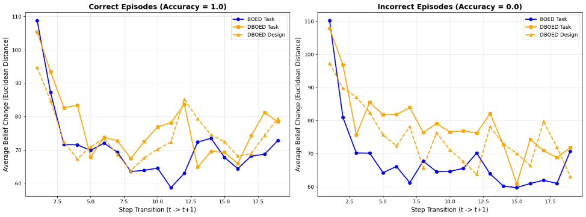
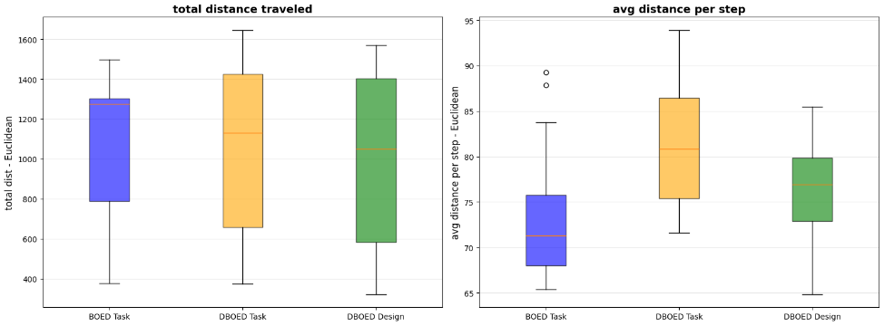
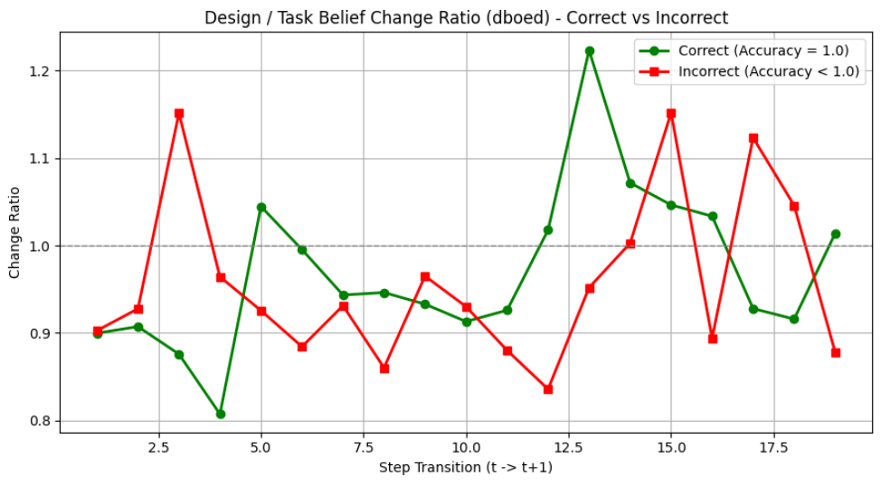
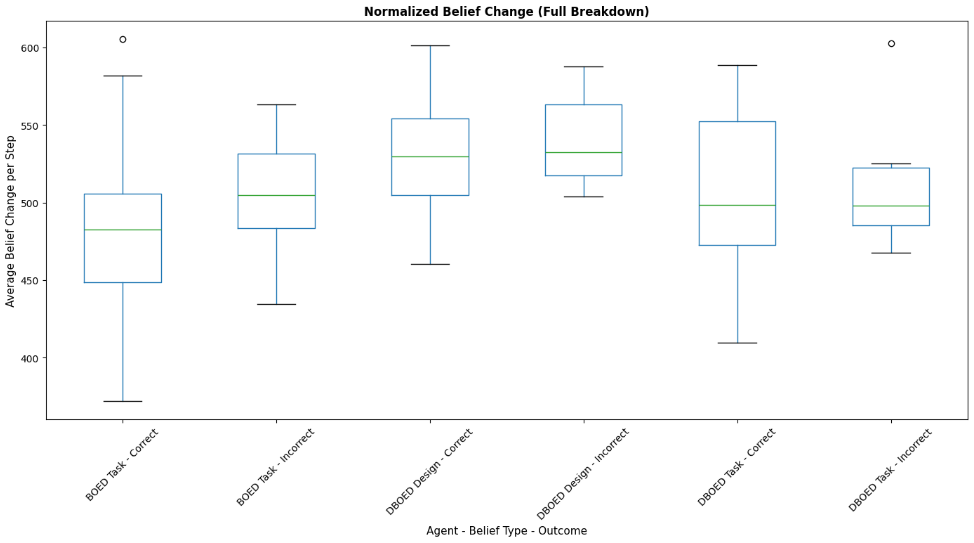
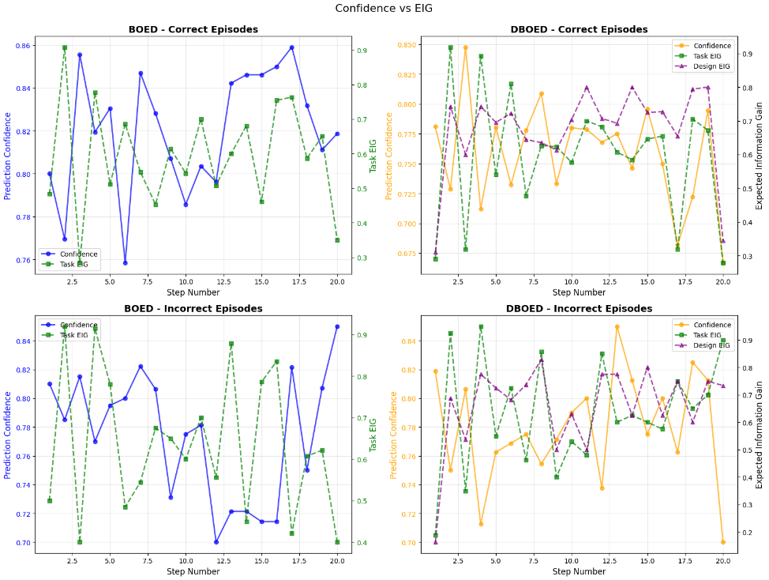
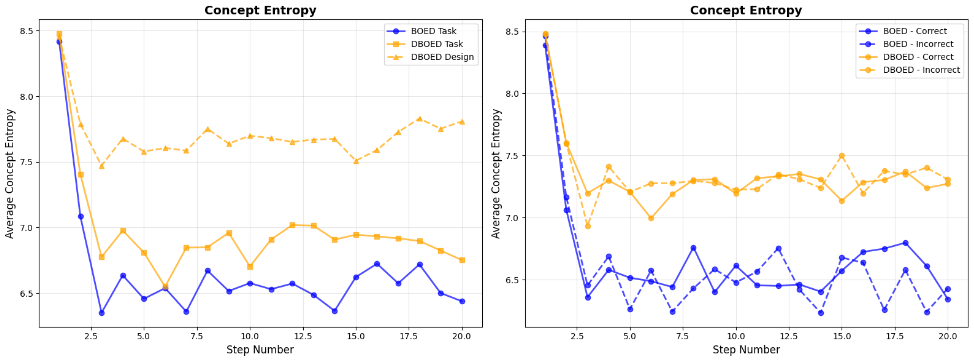
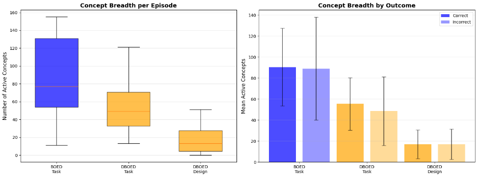
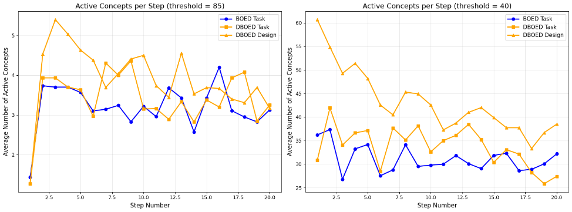
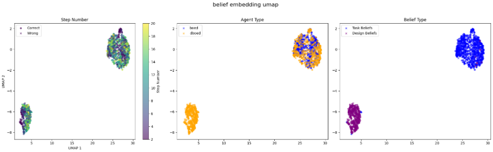
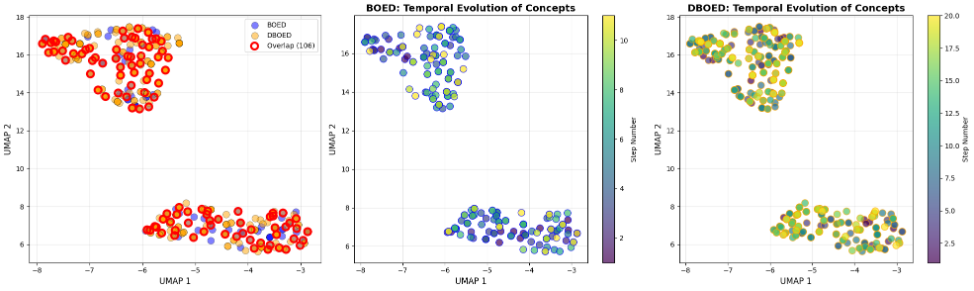

# Rematch Challenge: Comparing BOED and DBOED Agent Exploration Strategies

## Overview

This project analyzes the behavior of two agents — **Bayesian Optimal Experiment Design (BOED)** and **Design-Augmented Bayesian Optimal Experiment Design (DBOED)** — on 30 Supreme Court case classification tasks. Using each agent's exploration traces, belief embeddings, and concept graphs, the analysis examines how the two agents differ in how they explore a problem space and arrive at predictions.

## Goal

Given the agent data for the 30 classification tasks, the goal was to uncover trends and identify patterns in how the two agents explore, update their beliefs, and reason toward a final answer — and to understand what, if anything, the "design" belief system contributes beyond a standard task belief system.

## Methodology

For each analysis below, beliefs are treated as points in a multi-dimensional embedding space. Belief change between consecutive steps is primarily measured using Euclidean distance (a check against cosine distance showed nearly identical trends), broken out by agent, belief type (task vs. design), and outcome (correct vs. incorrect prediction).

## Analysis and Findings

### 1. Magnitude of Belief Change Over Time

Average belief change (Euclidean distance to the next belief) was computed at each step, separated by agent, belief type, and accuracy.

- All agents and belief types update drastically on the first step, likely due to the random initial starting point, then settle into a rough equilibrium of smaller up-and-down jumps.
- **Time to equilibrium correlates with accuracy**: correct episodes reach equilibrium by roughly step 5, while incorrect episodes don't settle until closer to step 7.5–10. This suggests that when an agent struggles to find relevant information, it keeps making large belief jumps for longer; when it finds what it needs quickly, it can spend more time refining within a smaller concept space.
- BOED beliefs update less drastically overall than DBOED beliefs, suggesting DBOED makes stronger, more directed jumps. Both agents show occasional large spikes, likely corresponding to key discoveries that significantly shift beliefs.

### 2. Total and Average Distance Traveled

Total distance traveled (summed across an episode) and average distance per step were compared across agents and belief types.

- Total distance traveled is roughly similar across all agents and belief types.
- Average distance *per step* is notably smaller for BOED task beliefs than for DBOED task or design beliefs — possibly because the combination of design and task beliefs lets DBOED make larger, more confident jumps by reasoning explicitly about its own thinking process.

### 3. Design vs. Task Belief Change Ratio (DBOED only)

The ratio of design-belief change to task-belief change was tracked at each step, split by outcome.

- No clear relationship emerges between relative design vs. task belief change. Both belief types update drastically near the beginning and end of an episode, with no step where one is static while the other moves — suggesting both are continuously active throughout the episode.

### 4. Normalized Belief Change by Agent, Belief Type, and Outcome

Belief changes were normalized per episode (to account for differing episode lengths) and compared across agent/belief-type/outcome groups.

- BOED and DBOED task beliefs change by roughly similar amounts.
- DBOED design beliefs change somewhat more than task beliefs, suggesting the way an agent reasons (its approach) is more mutable than the specific ideas it's reasoning about (its content).

### 5. Confidence vs. Expected Information Gain (EIG)

Prediction confidence was compared against expected information gain at each step for both agents.

- EIG and confidence appear inversely related for both agents — intuitively, when an agent expects to learn a lot from its next action, it implicitly knows it's still missing information needed for an accurate prediction.
- Correct episodes tend to show less erratic confidence and EIG than incorrect ones, suggesting more stable, confident reasoning is associated with better outcomes, while erratic swings track with confusion or being "lost" in the reasoning process.

### 6. Concept Entropy

Concept entropy (how spread out vs. focused an agent's attention is across concepts) was measured over time and by outcome.

- DBOED design beliefs show the highest entropy, consistent with a role focused on broad direction-setting and exploration.
- DBOED task beliefs show higher entropy than BOED task beliefs, suggesting the design belief system may "encourage" the task beliefs to consider a wider range of topics.
- Higher entropy helps avoid missing key information; lower entropy supports focused analysis and firm conclusions. Combining a high-entropy (design) system with a lower-entropy (task) system may be part of why DBOED achieves higher accuracy — though no direct correlation between entropy and accuracy was found at the level of individual episodes.

### 7. Concept Breadth (Number of Active Concepts)

Using an activation-salience threshold (results were robust across thresholds from roughly 40–90%), the number of "active" concepts per episode was compared across agents.

| Comparison | t-value | p-value | Difference |
|---|---|---|---|
| BOED Task vs DBOED Task | 3.862 | 0.000286 | +34.73 |
| DBOED Task vs DBOED Design | 6.414 | 0.000000 | +35.83 |
| BOED Task vs DBOED Design | 8.945 | 0.000000 | +70.57 |

- Differences in concept-activation counts between BOED and DBOED are statistically significant.
- Despite having higher entropy, DBOED activates *fewer* total concepts per episode than BOED — suggesting DBOED focuses in depth on a smaller set of important concepts over many steps, while BOED activates more concepts but analyzes each only briefly, likely including a number of irrelevant ones.

### 8. Active Concepts Over Time

Plotting active concept counts per step (at two different thresholds) reinforces the above: DBOED design beliefs maintain the broadest concept focus at any given step, consistent with their role in guiding general problem-solving direction, while BOED maintains a narrower focus throughout.

### 9. Belief Embedding UMAP Projection

Multi-dimensional beliefs were projected into 2D via UMAP to visualize how beliefs evolve over an episode (the first step was excluded, since it is always randomly initialized and sits apart from the rest).

- Early steps (2–4) form a distinct, tighter cluster, while later steps (10–20) become increasingly intermingled — consistent with agents quickly finding a general direction early on, then making smaller, incremental refinements later.
- Design beliefs show a slightly clearer directional gradient than task beliefs, suggesting the design system maintains a more consistent sense of "how to proceed" even when the task-level analysis is still uncertain.
- Task and design beliefs occupy almost entirely separate regions of the embedding space, consistent with their intended roles (design = approach, task = content), though some overlap suggests each system is aware of, and responsive to, the other.

### 10. Concept Activation Clusters

Concept activations were also projected via UMAP for individual episodes to look for shared vs. agent-specific concept usage.

- BOED and DBOED activate largely overlapping concept spaces, with no clear pattern distinguishing which agent activates which concepts.
- Concept activations typically form two distinct clusters per episode. For one example episode, cluster contents (labeled qualitatively with the help of a large language model) corresponded to (a) legal procedure, statutory analysis, case law, and judicial reasoning, and (b) case-specific technical elements (e.g., in one episode, age-verification technology combined with legal/regulatory analysis).
- DBOED tends to explore a narrower set of concepts initially and broaden its focus later, while BOED explores broadly at first and does little further exploration afterward — reflecting two different problem-solving styles: "explore broadly, then narrow" (BOED) vs. "orient first, then explore" (DBOED).

## Conclusion

Across 30 Supreme Court classification episodes, the DBOED agent's added design-belief system appears to provide real value: it helps the agent explore more targeted areas of the concept space, stay focused on what's relevant, and make faster, more confident updates to its task-level beliefs compared to the BOED agent alone.

## Future Work

- Apply machine learning methods (e.g., clustering, dimensionality reduction techniques beyond UMAP) to more rigorously analyze concept embeddings; this was not completed due to hardware limitations.
- Explore additional dimensions of the provided data not covered in this analysis.

## References

- Xiong, Zhen, Yujun Cai, Zhecheng Li, and Yiwei Wang. "Mapping the Minds of LLMs: A Graph-Based Analysis of Reasoning LLM." arXiv, May 20, 2025. https://doi.org/10.48550/arXiv.2505.13890
- He, Zhonghao, Tianyi Qiu, Hirokazu Shirado, and Maarten Sap. "Martingale Score: An Unsupervised Metric for Bayesian Rationality in LLM Reasoning," December 2, 2025. https://doi.org/10.48550/arXiv.2512.02914
- Lidayan, Aly, Jakob Brandt Bjorner, Satvik Golechha, and Alane Suhr. "ABBEL: LLM Agents Acting through Belief Bottlenecks Expressed in Language," 2025. https://openreview.net/forum?id=DNLD6pWP8l

## Acknowledgments

AI coding assistants were used to help understand the data and generate plots/tables in Python, and a general-purpose AI chat assistant was used to help clarify task goals and answer background questions during the analysis.
